# AI THERAPIST STAGE 1 - STATE ACTION DIAGRAMS (MERMAID)

**Interactive Flow Diagrams for System Visualization**

---

## 📊 MAIN PROGRESSION FLOW

### Complete Stage 1 Flow (Happy Path)

---

## 🚨 PRIORITY REDIRECTS

### Priority Routing System (Can Interrupt Any State)

---

## 🔄 LOOP PREVENTION SYSTEM

### Loop Detection and Escape Routes

```mermaid
graph TD
    subgraph "LOOP 1: Body Awareness"
        S1[2.1_seek State] -->|Attempt 1| C1{Body<br/>Mentioned?}
        C1 -->|Yes| EXIT1[→ 2.2 Location]
        C1 -->|No| COUNT1[Counter: 1]
        COUNT1 --> S1

        S1 -->|Attempt 2| C2{Body<br/>Mentioned?}
        C2 -->|Yes| EXIT1
        C2 -->|No| COUNT2[Counter: 2]
        COUNT2 --> S1

        S1 -->|Attempt 3| C3{Body<br/>Mentioned?}
        C3 -->|Yes| EXIT1
        C3 -->|No| ESC1{Escape<br/>Route}
        ESC1 -->|Option A| CARD1[Trigger<br/>card_game]
        ESC1 -->|Option B| SKIP1[Skip to 3.1]
        CARD1 --> EXIT1
    end

    subgraph "LOOP 2: Thinking Mode"
        T1[THINK State] -->|Attempt 1| TC1{Feeling<br/>Response?}
        TC1 -->|Yes| TEXIT[Return to Flow]
        TC1 -->|No| TCOUNT1[Counter: 1]
        TCOUNT1 --> T1

        T1 -->|Attempt 2| TC2{Feeling<br/>Response?}
        TC2 -->|Yes| TEXIT
        TC2 -->|No| TCOUNT2[Counter: 2]
        TCOUNT2 --> T1

        T1 -->|Attempt 3| TESC[Escape to 3.2<br/>Alpha Grounding]
    end

    subgraph "LOOP 3: Past Tense"
        P1[PAST State] -->|Attempt 1| PC1{Present<br/>Response?}
        PC1 -->|Yes| PEXIT[Return to Flow]
        PC1 -->|No| PCOUNT1[Counter: 1]
        PCOUNT1 --> P1

        P1 -->|Attempt 2| PC2{Present<br/>Response?}
        PC2 -->|Yes| PEXIT
        PC2 -->|No| PCOUNT2[Counter: 2]
        PCOUNT2 --> P1

        P1 -->|Attempt 3| PESC[Escape to 3.2<br/>Alpha Anchoring]
    end

    TESC --> ALPHA[3.2 → 3.3<br/>Alpha Sequence]
    PESC --> ALPHA

    style ESC1 fill:#ffd43b
    style TESC fill:#ffd43b
    style PESC fill:#ffd43b
    style ALPHA fill:#ffe6e6
    style CARD1 fill:#ffccff
```

---

## 🎯 SPECIAL STATES HANDLING

### Edge Cases and Special Situations

---

## 🔧 FRAMEWORK TRIGGERS

### When Frameworks Are Triggered

```mermaid
graph LR
    subgraph "Framework Triggers"
        A[3.3 Execute Alpha] -->|Always| AF1[⚡alpha_sequence<br/>6 steps + body checks]

        B[SELFHARM State] -->|Always| AF2[⚡no_harm<br/>Safety protocol]

        C[CRISIS State] -->|If unsafe| AF3[⚡no_harm<br/>Emergency]

        D[SILENT State] -->|After 2 attempts| AF4[⚡card_game<br/>Non-verbal]

        E[2.1_seek Loop] -->|After 3 attempts| AF5[⚡card_game<br/>OR skip to 3.1]

        F[Client Confused] -->|On-demand| AF6[⚡metaphors Type A<br/>Vector DB query]

        G[Stage 2 Strategic] -->|Per TRT PDF| AF7[⚡metaphors Type B<br/>Trauma explanation]
    end

    style AF1 fill:#ffe6e6
    style AF2 fill:#ff6b6b
    style AF3 fill:#c92a2a
    style AF4 fill:#ffccff
    style AF5 fill:#ffccff
    style AF6 fill:#e6f7ff
    style AF7 fill:#e6f7ff
```

---

## 🎭 COMPLETE SYSTEM OVERVIEW

### All Components Together

---

## 📈 STATE STATISTICS

### System Composition

---

## 🔍 DECISION TREE

### Master Agent Decision Logic

```mermaid
graph TD
    START([Client Message]) --> P1{Self-Harm<br/>Detected?}

    P1 -->|YES| ACT1[Route to SELFHARM<br/>PRIORITY 1<br/>⚡no_harm]
    P1 -->|NO| P2{Thinking<br/>Mode?}

    P2 -->|YES| ACT2[Route to THINK<br/>PRIORITY 2<br/>Max 3→Alpha]
    P2 -->|NO| P3{Past<br/>Tense?}

    P3 -->|YES| ACT3[Route to PAST<br/>PRIORITY 2<br/>Max 3→Alpha]
    P3 -->|NO| P4{Body Words<br/>+ Present?}

    P4 -->|YES| ACT4[Route to AFFIRM<br/>PRIORITY 3<br/>60%+ usage]
    P4 -->|NO| P5{Current<br/>State?}

    P5 --> STATE_LOGIC{State-Specific<br/>Logic}

    STATE_LOGIC -->|State 1.x| GOAL[Goal/Vision<br/>States]
    STATE_LOGIC -->|State 2.x| BODY[Body Awareness<br/>States]
    STATE_LOGIC -->|State 3.x| ALPHA_S[Alpha Sequence<br/>States]
    STATE_LOGIC -->|State 4.x| TRANS[Transition<br/>State]
    STATE_LOGIC -->|Special| SPECIAL[Special<br/>States]

    GOAL --> ROUTE[Determine Route]
    BODY --> ROUTE
    ALPHA_S --> ROUTE
    TRANS --> ROUTE
    SPECIAL --> ROUTE

    ROUTE --> LOOP_CHK{Loop<br/>Counter<br/>>= 3?}

    LOOP_CHK -->|YES| ESCAPE_R[Trigger<br/>Escape Route]
    LOOP_CHK -->|NO| NORMAL[Normal<br/>Routing]

    ESCAPE_R --> NEXT
    NORMAL --> NEXT[Next State]

    style ACT1 fill:#ff6b6b
    style ACT2 fill:#ffd43b
    style ACT3 fill:#ffd43b
    style ACT4 fill:#51cf66
    style ESCAPE_R fill:#ffa94d
```

---

## 💡 USAGE INSTRUCTIONS

### How to Use These Diagrams

1. **Copy** any diagram code block above
2. **Paste** into:
   - [Mermaid Live Editor](https://mermaid.live)
   - GitHub markdown (supports mermaid natively)
   - Any mermaid-compatible tool
3. **View** the interactive diagram
4. **Export** as SVG or PNG if needed

### Diagram Types Included

- **Main Progression Flow** - Complete happy path from start to Stage 2
- **Priority Redirects** - How priority routing interrupts flow
- **Loop Prevention** - How loops are detected and escaped
- **Special States** - Edge case handling
- **Framework Triggers** - When frameworks activate
- **System Overview** - Complete architecture
- **Decision Tree** - Master Agent logic flow

---

**Created:** 2025-10-08
**System:** AI Therapist Stage 1
**Total States:** 31
**Total Diagrams:** 8

---

*State Diagrams - AI Therapist Stage 1*
*Interactive Mermaid Visualizations*
